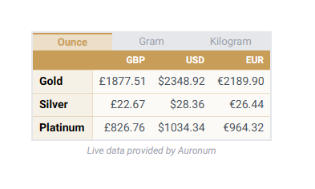
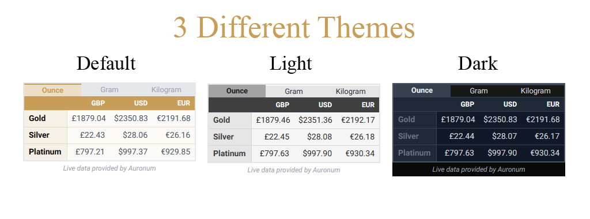
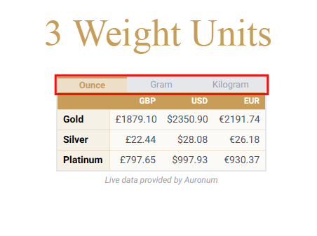

# Live Gold Price Table

## Description

The Live Gold Price Table plugin enables you to effortlessly display real-time prices of Gold, Silver, and Platinum on your WordPress site. Simply use the provided shortcode `[live_gold]` in your posts, pages, or widgets to embed the price table.

Customize the appearance of the price table by specifying a theme. Available themes include "brand", "dark", and "light", with "brand" being the default. To specify a theme, use the attribute `theme` in the shortcode. For example: `[live_gold theme="dark"]`.

For technical support, contact us at [support@auronum.co.uk](mailto:support@auronum.co.uk).

Visit our website at [Auronum](https://auronum.co.uk).

## Installation

1. Upload the `live-gold-price-table` folder to the `/wp-content/plugins/` directory or download the `live-gold-price-table.zip` file and upload it through the 'Plugins' menu in WordPress.
2. Activate the plugin through the 'Plugins' menu in WordPress.
3. Use the shortcode `[live_gold]` in your posts, pages, or widgets to display the live gold price table.
4. Customize the appearance by specifying a theme using the attribute `theme` in the shortcode.

## Frequently Asked Questions

### How do I display the live gold price table on my site?

Simply use the shortcode `[live_gold]` in your posts, pages, or widgets.

### How do I customize the appearance of the price table?

You can customize the appearance by specifying a theme using the attribute `theme` in the shortcode. Available themes are "brand", "dark", and "light", with "brand" being the default. For example: `[live_gold theme="dark"]`.

## Screenshots

### Three Different Themes To Choose From

### Three Different Weight Units

## Download

You can download the latest release of Live Gold Price Table from [GitHub](https://github.com/Auronum/live-gold-price-table/releases).

## Changelog

### 1.0
- Initial release

## Upgrade Notice

### 1.0
- Initial release

## Credits

This plugin is developed and maintained by [Auronum](https://auronum.co.uk).

## License

This plugin is licensed under the GPLv2 or later - [License](http://www.gnu.org/licenses/gpl-2.0.html)
